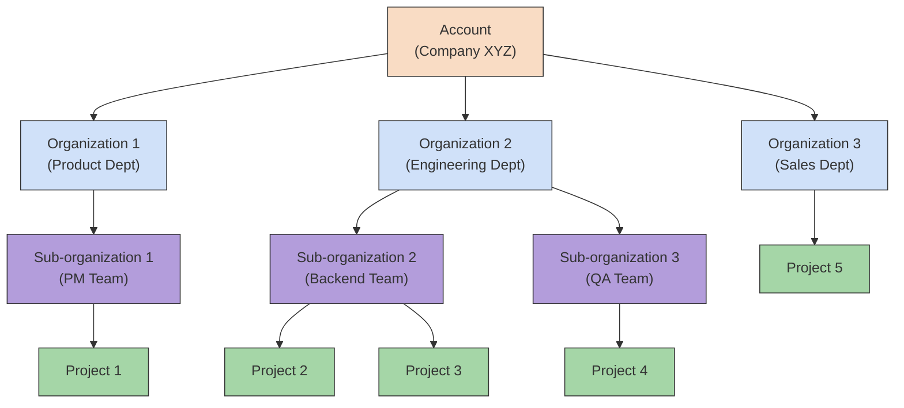

This document outlines the organizational structure and user roles within Katalon TestOps, with a focus on the administrative (Admin) functions

Katalon TestOps uses a tiered administration system that groups all account management and platform settings under a single Admin section. It consists of two hierarchical levels:

- **Account Level**: Centralizes global settings across the organization (for Admins).
- **Project Level**: Manages settings within individual projects (for Testers/QA).

A typical organizational structure looks like this:

## About Roles

- When a user is added to an Account, they are assigned the **User** role by default.
- When a user is added to a Project, they are assigned the **Tester** role by default.
- A user can have **multiple roles** across projects or scopes. Their effective permissions will be the **union** **of all assigned roles**.    

Roles determine what a user can see and do, whether at the Account level (for administrative tasks) or the Project level (for test-related work). Assigning the right roles ensures users have appropriate access based on their responsibilities.

> The in-app Permission Guide still references shorthand such as `C`, `R`, `U`, and `D` for Create, Read, Update, and Delete (and occasionally `A` for Archive). The action lists below spell out the same capabilities in plain language.

## Account-Level Roles

| Role | Description |
| --- | --- |
| Account Admin | Manages account-level settings, subscriptions, and permission templates. |
| System Admin | Manages system settings and third-party integrations. |
| User | Base-level access. Required for any user joining an account. |

### Actions Available at the Account Level
<table
  className="table anchor_top_offset"
  id="table-584f02"
  style={ { width: "100%", tableLayout: "fixed", borderCollapse: "collapse", wordBreak: "break-word" } }
>
  <caption />
  <colgroup>
      <col style={ { width: "20%" } } />
      <col style={ { width: "34%" } } />
      <col style={ { width: "34%" } } />
      <col style={ { width: "12%" } } />
  </colgroup>

  <thead className="thead">
    <tr>
        <th>
        </th>
        <th>
          **_Account Admin_**
        </th>
        <th>
          **_System Admin_**
        </th>
        <th>
          **_User_**
        </th>
    </tr>
  </thead>

  <tbody className="tbody">
      <tr>
        <td
          className="entry"
          style={ { padding: 8, wordBreak: "break-word", border: "1px solid #e5e7eb" } }
        >
          **User Management**
        </td>
        <td
          className="entry"
          style={ { padding: 8, wordBreak: "break-word", border: "1px solid #e5e7eb" } }
        >
          • Invite users 
          • Revoke invitation 
          • Resend invitation 
          • Edit users role 
          • Remove users from Account 
          • Export User Management page
        </td>
        <td
          className="entry"
          style={ { padding: 8, wordBreak: "break-word", border: "1px solid #e5e7eb" } }
        >
          No access
        </td>
        <td
          className="entry"
          style={ { padding: 8, wordBreak: "break-word", border: "1px solid #e5e7eb" } }
        >
          No access
        </td>
      </tr>
      <tr>
        <td
          className="entry"
          style={ { padding: 8, wordBreak: "break-word", border: "1px solid #e5e7eb" } }
        >
          **Subscription Management**
        </td>
        <td
          className="entry"
          style={ { padding: 8, wordBreak: "break-word", border: "1px solid #e5e7eb" } }
        >
          • Purchase subscription 
          • Upgrade subscription 
          • Cancel subscription
        </td>
        <td
          className="entry"
          style={ { padding: 8, wordBreak: "break-word", border: "1px solid #e5e7eb" } }
        >
          No access
        </td>
        <td
          className="entry"
          style={ { padding: 8, wordBreak: "break-word", border: "1px solid #e5e7eb" } }
        >
          No access
        </td>
      </tr>
      <tr>
        <td
          className="entry"
          style={ { padding: 8, wordBreak: "break-word", border: "1px solid #e5e7eb" } }
        >
          **Project Management**
        </td>
        <td
          className="entry"
          style={ { padding: 8, wordBreak: "break-word", border: "1px solid #e5e7eb" } }
        >
          • View the Project list and details 
          • Create a Project 
          • Edit Project’s name 
          • Delete a Project 
          • Invite users to Project 
          • Resend invitations to Project 
          • Remove users from Project 
          • Edit user's Project role
        </td>
        <td
          className="entry"
          style={ { padding: 8, wordBreak: "break-word", border: "1px solid #e5e7eb" } }
        >
          No access
        </td>
        <td
          className="entry"
          style={ { padding: 8, wordBreak: "break-word", border: "1px solid #e5e7eb" } }
        >
          No access
        </td>
      </tr>
      <tr>
        <td
          className="entry"
          style={ { padding: 8, wordBreak: "break-word", border: "1px solid #e5e7eb" } }
        >
          **Payment Method**
        </td>
        <td
          className="entry"
          style={ { padding: 8, wordBreak: "break-word", border: "1px solid #e5e7eb" } }
        >
          • View payment method 
          • Edit payment method 
          • Delete payment method
        </td>
        <td
          className="entry"
          style={ { padding: 8, wordBreak: "break-word", border: "1px solid #e5e7eb" } }
        >
          No access
        </td>
        <td
          className="entry"
          style={ { padding: 8, wordBreak: "break-word", border: "1px solid #e5e7eb" } }
        >
          No access
        </td>
      </tr>
      <tr>
        <td
          className="entry"
          style={ { padding: 8, wordBreak: "break-word", border: "1px solid #e5e7eb" } }
        >
          **License Management**
        </td>
        <td
          className="entry"
          style={ { padding: 8, wordBreak: "break-word", border: "1px solid #e5e7eb" } }
        >
          • View License Management page 
          • Assign licenses to users 
          • Revoke licenses from users
        </td>
        <td
          className="entry"
          style={ { padding: 8, wordBreak: "break-word", border: "1px solid #e5e7eb" } }
        >
          No access
        </td>
        <td
          className="entry"
          style={ { padding: 8, wordBreak: "break-word", border: "1px solid #e5e7eb" } }
        >
          No access
        </td>
      </tr>
      <tr>
        <td
          className="entry"
          style={ { padding: 8, wordBreak: "break-word", border: "1px solid #e5e7eb" } }
        >
          **Organization Management**
        </td>
        <td
          className="entry"
          style={ { padding: 8, wordBreak: "break-word", border: "1px solid #e5e7eb" } }
        >
          • Create Organizations 
          • View Organization information 
          • Update Organization information
        </td>
        <td
          className="entry"
          style={ { padding: 8, wordBreak: "break-word", border: "1px solid #e5e7eb" } }
        >
          No access
        </td>
        <td
          className="entry"
          style={ { padding: 8, wordBreak: "break-word", border: "1px solid #e5e7eb" } }
        >
          No access
        </td>
      </tr>
      <tr>
        <td
          className="entry"
          style={ { padding: 8, wordBreak: "break-word", border: "1px solid #e5e7eb" } }
        >
          **Account Settings**
        </td>
        <td
          className="entry"
          style={ { padding: 8, wordBreak: "break-word", border: "1px solid #e5e7eb" } }
        >
          • View Account information 
          • Update Account information 
          • Delete Account
        </td>
        <td
          className="entry"
          style={ { padding: 8, wordBreak: "break-word", border: "1px solid #e5e7eb" } }
        >
          No access
        </td>
        <td
          className="entry"
          style={ { padding: 8, wordBreak: "break-word", border: "1px solid #e5e7eb" } }
        >
          No access
        </td>
      </tr>
      <tr>
        <td
          className="entry"
          style={ { padding: 8, wordBreak: "break-word", border: "1px solid #e5e7eb" } }
        >
          **Security Settings**
        </td>
        <td
          className="entry"
          style={ { padding: 8, wordBreak: "break-word", border: "1px solid #e5e7eb" } }
        >
          • Configure Idle TimeOut 
          • Configure Session Timeout 
          • Configure IP Address Whitelist 
          • Configure Single Sign-On
        </td>
        <td
          className="entry"
          style={ { padding: 8, wordBreak: "break-word", border: "1px solid #e5e7eb" } }
        >
          • Configure Idle TimeOut 
          • Configure Session Timeout 
          • Configure IP Address Whitelist 
          • Configure Single Sign-On
        </td>
        <td
          className="entry"
          style={ { padding: 8, wordBreak: "break-word", border: "1px solid #e5e7eb" } }
        >
          No access
        </td>
      </tr>
      <tr>
        <td
          className="entry"
          style={ { padding: 8, wordBreak: "break-word", border: "1px solid #e5e7eb" } }
        >
          **Integration Settings**
        </td>
        <td
          className="entry"
          style={ { padding: 8, wordBreak: "break-word", border: "1px solid #e5e7eb" } }
        >
          • Create an Integration 
          • Disconnect an Integration 
          • Update an Integration
        </td>
        <td
          className="entry"
          style={ { padding: 8, wordBreak: "break-word", border: "1px solid #e5e7eb" } }
        >
          • Create an Integration 
          • Disconnect an Integration 
          • Update an Integration
        </td>
        <td
          className="entry"
          style={ { padding: 8, wordBreak: "break-word", border: "1px solid #e5e7eb" } }
        >
          No access
        </td>
      </tr>
      <tr>
        <td
          className="entry"
          style={ { padding: 8, wordBreak: "break-word", border: "1px solid #e5e7eb" } }
        >
          **AI Settings**
        </td>
        <td
          className="entry"
          style={ { padding: 8, wordBreak: "break-word", border: "1px solid #e5e7eb" } }
        >
          • Enable AI setting 
          • Disable AI setting 
          • Update AI setting 
          • Add AI key 
          • Delete AI key
        </td>
        <td
          className="entry"
          style={ { padding: 8, wordBreak: "break-word", border: "1px solid #e5e7eb" } }
        >
          • Enable AI setting 
          • Disable AI setting 
          • Update AI setting 
          • Add AI key 
          • Delete AI key
        </td>
        <td
          className="entry"
          style={ { padding: 8, wordBreak: "break-word", border: "1px solid #e5e7eb" } }
        >
          No access
        </td>
      </tr>
      <tr>
        <td
          className="entry"
          style={ { padding: 8, wordBreak: "break-word", border: "1px solid #e5e7eb" } }
        >
          **Other Configurations**
        </td>
        <td
          className="entry"
          style={ { padding: 8, wordBreak: "break-word", border: "1px solid #e5e7eb" } }
        >
          • Add KRE Agents 
          • Configure KRE Agents 
          • Create Application under Test 
          • View Application under Test list 
          • Delete Application under Test
        </td>
        <td
          className="entry"
          style={ { padding: 8, wordBreak: "break-word", border: "1px solid #e5e7eb" } }
        >
          • Add KRE Agents 
          • Configure KRE Agents 
          • Create Application under Test 
          • View Application under Test list 
          • Delete Application under Test
        </td>
        <td
          className="entry"
          style={ { padding: 8, wordBreak: "break-word", border: "1px solid #e5e7eb" } }
        >
          No access
        </td>
      </tr>
  </tbody>
</table>

## Project-Level Roles

| Role | Description |
| --- | --- |
| Project Admin | Manages project settings, roles, and integrations. |
| Test Lead | Approves test cases, manages key testing artifacts. |
| Tester | Creates and updates test cases, test runs, test suites, etc. |
| Member | Read-only or limited access, based on license and permission template. |

### Actions Available at the Project Level

<table
  className="table anchor_top_offset"
  id="table-10ac01"
  style={ { width: "100%", tableLayout: "fixed", borderCollapse: "collapse", wordBreak: "break-word" } }
>
  <caption />
  <colgroup>
      <col style={ { width: "16%" } } />
      <col style={ { width: "21%" } } />
      <col style={ { width: "21%" } } />
      <col style={ { width: "21%" } } />
      <col style={ { width: "21%" } } />
  </colgroup>

  <thead className="thead">
    <tr>
        <th>
           
        </th>
        <th>
          _**Project Admin**_
        </th>
        <th>
          _**Test Lead**_
        </th>
        <th>
          _**Tester**_
        </th>
        <th>
          _**Member**_
        </th>
    </tr>
  </thead>

  <tbody className="tbody">
      <tr>
        <td
          className="entry"
          style={ { padding: 8, verticalAlign: "top", wordBreak: "break-word", border: "1px solid #e5e7eb" } }
        >
          **Project Management**
        </td>
        <td
          className="entry"
          style={ { padding: 8, verticalAlign: "top", wordBreak: "break-word", border: "1px solid #e5e7eb" } }
        >
          • View Project’s General Information 
          • Edit Project’s name 
          • Invite users to Project 
          • Resend invitations to Project 
          • Remove users from Project 
          • Edit user's Project role                                                                                                              
        </td>
        <td
          className="entry"
          style={ { padding: 8, verticalAlign: "top", wordBreak: "break-word", border: "1px solid #e5e7eb" } }
        >
          No access
        </td>
        <td
          className="entry"
          style={ { padding: 8, verticalAlign: "top", wordBreak: "break-word", border: "1px solid #e5e7eb" } }
        >
          No access
        </td>
        <td
          className="entry"
          style={ { padding: 8, verticalAlign: "top", wordBreak: "break-word", border: "1px solid #e5e7eb" } }
        >
          No access
        </td>
      </tr>
      <tr>
        <td
          className="entry"
          style={ { padding: 8, verticalAlign: "top", wordBreak: "break-word", border: "1px solid #e5e7eb" } }
        >
          **Project Integrations** (Note: Integrations must first be set up at the Account-level)
        </td>
        <td
          className="entry"
          style={ { padding: 8, verticalAlign: "top", wordBreak: "break-word", border: "1px solid #e5e7eb" } }
        >
          • Configure integrations 
          • Edit integrations 
          • Archive/unarchive integrations 
          • View integrations
        </td>
        <td
          className="entry"
          style={ { padding: 8, verticalAlign: "top", wordBreak: "break-word", border: "1px solid #e5e7eb" } }
        >
          No access
        </td>
        <td
          className="entry"
          style={ { padding: 8, verticalAlign: "top", wordBreak: "break-word", border: "1px solid #e5e7eb" } }
        >
          No access
        </td>
        <td
          className="entry"
          style={ { padding: 8, verticalAlign: "top", wordBreak: "break-word", border: "1px solid #e5e7eb" } }
        >
          No access
        </td>
      </tr>
      <tr>
        <td
          className="entry"
          style={ { padding: 8, verticalAlign: "top", wordBreak: "break-word", border: "1px solid #e5e7eb" } }
        >
          **Project Configurations**
        </td>
        <td
          className="entry"
          style={ { padding: 8, verticalAlign: "top", wordBreak: "break-word", border: "1px solid #e5e7eb" } }
        >
          • View KRE Agent Information 
          • Connect/Disconnect KRE Agent 
          • Link AUT (Application Under Test) 
          • View linked AUT
        </td>
        <td
          className="entry"
          style={ { padding: 8, verticalAlign: "top", wordBreak: "break-word", border: "1px solid #e5e7eb" } }
        >
          No access
        </td>
        <td
          className="entry"
          style={ { padding: 8, verticalAlign: "top", wordBreak: "break-word", border: "1px solid #e5e7eb" } }
        >
          No access
        </td>
        <td
          className="entry"
          style={ { padding: 8, verticalAlign: "top", wordBreak: "break-word", border: "1px solid #e5e7eb" } }
        >
          No access
        </td>
      </tr>
      <tr>
        <td
          className="entry"
          style={ { padding: 8, verticalAlign: "top", wordBreak: "break-word", border: "1px solid #e5e7eb" } }
        >
          **Home (Reports and Analytics)**
        </td>
        <td
          className="entry"
          style={ { padding: 8, verticalAlign: "top", wordBreak: "break-word", border: "1px solid #e5e7eb" } }
        >
          • View dashboard 
          • Add dashboard 
          • Edit dashboard 
          • Edit threshold for dashboard 
          • Export/Share dashboard/test report
        </td>
        <td
          className="entry"
          style={ { padding: 8, verticalAlign: "top", wordBreak: "break-word", border: "1px solid #e5e7eb" } }
        >
          • View dashboard 
          • Add dashboard 
          • Edit dashboard 
          • Edit threshold for dashboard 
          • Export/Share dashboard/test report
        </td>
        <td
          className="entry"
          style={ { padding: 8, verticalAlign: "top", wordBreak: "break-word", border: "1px solid #e5e7eb" } }
        >
          • View dashboard 
          • Export/Share dashboard/test report
        </td>
        <td
          className="entry"
          style={ { padding: 8, verticalAlign: "top", wordBreak: "break-word", border: "1px solid #e5e7eb" } }
        >
          • View dashboard 
          • Export/Share dashboard/test report
        </td>
      </tr>
      <tr>
        <td
          className="entry"
          style={ { padding: 8, verticalAlign: "top", wordBreak: "break-word", border: "1px solid #e5e7eb" } }
        >
          **Planning**
        </td>
        <td
          className="entry"
          style={ { padding: 8, verticalAlign: "top", wordBreak: "break-word", border: "1px solid #e5e7eb" } }
        >
          • View Sprint Timelines 
          • View Plans (Sprints & Releases) 
          • Edit Items of a Sprint/Release
        </td>
        <td
          className="entry"
          style={ { padding: 8, verticalAlign: "top", wordBreak: "break-word", border: "1px solid #e5e7eb" } }
        >
          • View Sprint Timelines 
          • View Plans (Sprints & Releases) 
          • Edit Items of a Sprint/Release
        </td>
        <td
          className="entry"
          style={ { padding: 8, verticalAlign: "top", wordBreak: "break-word", border: "1px solid #e5e7eb" } }
        >
          • View Sprint Timelines 
          • View Plans (Sprints & Releases) 
          • Edit Items of a Sprint/Release
        </td>
        <td
          className="entry"
          style={ { padding: 8, verticalAlign: "top", wordBreak: "break-word", border: "1px solid #e5e7eb" } }
        >
          • View Sprint Timelines 
          • View Plans (Sprints & Releases)
        </td>
      </tr>
      <tr>
        <td
          className="entry"
          style={ { padding: 8, verticalAlign: "top", wordBreak: "break-word", border: "1px solid #e5e7eb" } }
        >
          **Tests**
        </td>
        <td
          className="entry"
          style={ { padding: 8, verticalAlign: "top", wordBreak: "break-word", border: "1px solid #e5e7eb" } }
        >
          • Create test case/test suite 
          • Import test case 
          • Edit test case/test suite 
          • Delete test case/test suite 
          • View test case/test suite
        </td>
        <td
          className="entry"
          style={ { padding: 8, verticalAlign: "top", wordBreak: "break-word", border: "1px solid #e5e7eb" } }
        >
          • Create test case/test suite 
          • Import test case 
          • Edit test case/test suite 
          • Delete test case/test suite 
          • View test case/test suite
        </td>
        <td
          className="entry"
          style={ { padding: 8, verticalAlign: "top", wordBreak: "break-word", border: "1px solid #e5e7eb" } }
        >
          • Create test case/test suite 
          • Import test case 
          • Edit test case/test suite 
          • Delete test case/test suite 
          • View test case/test suite
        </td>
        <td
          className="entry"
          style={ { padding: 8, verticalAlign: "top", wordBreak: "break-word", border: "1px solid #e5e7eb" } }
        >
          View test case/test suite
        </td>
      </tr>
      <tr>
        <td
          className="entry"
          style={ { padding: 8, verticalAlign: "top", wordBreak: "break-word", border: "1px solid #e5e7eb" } }
        >
          **Executions**
        </td>
        <td
          className="entry"
          style={ { padding: 8, verticalAlign: "top", wordBreak: "break-word", border: "1px solid #e5e7eb" } }
        >
          • View Execution details and logs 
          • Create Automated Test Run 
          • Create Manual Test Run 
          • Start/Run Execution 
          • Edit/Delete Execution 
          • View Visual Testing Info 
          • Manage Recurring Test Run 
          • Comment/Attach files in manual execution 
          • Report defects
        </td>
        <td
          className="entry"
          style={ { padding: 8, verticalAlign: "top", wordBreak: "break-word", border: "1px solid #e5e7eb" } }
        >
          • View Execution details and logs 
          • Create Automated Test Run 
          • Create Manual Test Run 
          • Start/Run Execution 
          • Edit/Delete Execution 
          • View Visual Testing Info 
          • Manage Recurring Test Run 
          • Comment/Attach files in manual execution 
          • Report defects
        </td>
        <td
          className="entry"
          style={ { padding: 8, verticalAlign: "top", wordBreak: "break-word", border: "1px solid #e5e7eb" } }
        >
          • View Execution details and logs 
          • Create Automated Test Run 
          • Create Manual Test Run 
          • Start/Run Execution 
          • Edit/Delete Execution 
          • View Visual Testing Info 
          • Manage Recurring Test Run 
          • Comment/Attach files in manual execution 
          • Report defects
        </td>
        <td
          className="entry"
          style={ { padding: 8, verticalAlign: "top", wordBreak: "break-word", border: "1px solid #e5e7eb" } }
        >
          • View Execution details and logs 
          • View Visual Testing Info
        </td>
      </tr>
      <tr>
        <td
          className="entry"
          style={ { padding: 8, verticalAlign: "top", wordBreak: "break-word", border: "1px solid #e5e7eb" } }
        >
          **TestCloud**
        </td>
        <td
          className="entry"
          style={ { padding: 8, verticalAlign: "top", wordBreak: "break-word", border: "1px solid #e5e7eb" } }
        >
          • Upload Applications (.apk/.ipa/.zip) 
          • Live Testing: Mobile App, Mobile Browser, Desktop Browser 
          • Delete Applications 
          • View Application Info
        </td>
        <td
          className="entry"
          style={ { padding: 8, verticalAlign: "top", wordBreak: "break-word", border: "1px solid #e5e7eb" } }
        >
          • Upload Applications (.apk/.ipa/.zip) 
          • Live Testing: Mobile App, Mobile Browser, Desktop Browser 
          • Delete Applications 
          • View Application Info
        </td>
        <td
          className="entry"
          style={ { padding: 8, verticalAlign: "top", wordBreak: "break-word", border: "1px solid #e5e7eb" } }
        >
          • Upload Applications (.apk/.ipa/.zip) 
          • Live Testing: Mobile App, Mobile Browser, Desktop Browser 
          • Delete Applications 
          • View Application Info
        </td>
        <td
          className="entry"
          style={ { padding: 8, verticalAlign: "top", wordBreak: "break-word", border: "1px solid #e5e7eb" } }
        >
          View application Information
        </td>
      </tr>
  </tbody>
</table>