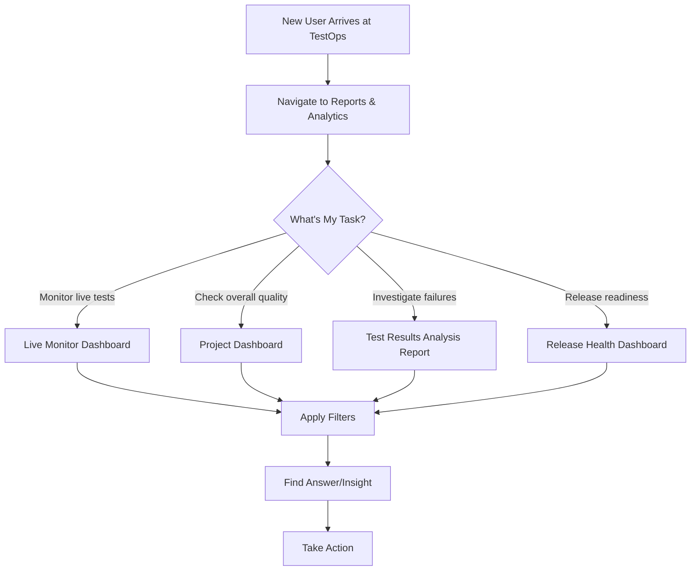

{

How to integrate with TestOps to get data

Arcade to demonstrate overall features

Explore Dashboards (mention purpose, kinds of dashboards)

Explore Reports (mention purpose different from dashboards, groups of concerns and corresponding reports)

}

