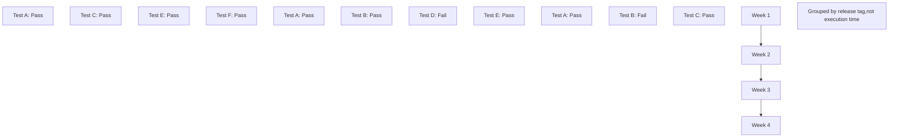

# Analyze Error Patterns

Content coming soon.
## 1
this is content
this is content
this is content
this is content
this is content
this is content
this is content
this is content
this is content
this is content
this is content
this is content
this is content
this is content
this is content
this is content
this is content
this is content
this is content
this is content
this is content
this is content
this is content
this is content
this is content
this is content
this is content
this is content
this is content
this is content

this is content

this is content

this is content

this is content

this is content

this is content

this is content

this is content

this is content

this is content

this is content

this is content

this is content

this is content

this is content

this is content

this is content

this is content

this is content

this is content

this is content

this is content

this is content

this is content

this is contentv

## 2

this is content

this is content

this is content

this is content

this is content

this is content

this is content

this is content

this is content

this is content

this is content

this is content

this is content

this is content

this is content

this is content

this is content

this is content

this is content

this is content

this is content

this is content